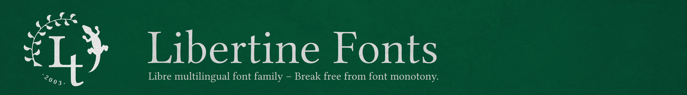

<!-- TOC depthFrom:1 depthTo:6 withLinks:1 updateOnSave:1 orderedList:0 -->

- [Libertine Design-Guidelines](#libertine-design-guidelines)
	- [Design Principals / Reference Implementation](#design-principals-reference-implementation)
		- [The Perfection of the Imperfect](#the-perfection-of-the-imperfect)
		- [The serifs of Libertine](#the-serifs-of-libertine)
			- [The foot serifs](#the-foot-serifs)
			- [The middle head serifs (at x-height)](#the-middle-head-serifs-at-x-height)
			- [The upper head serifs (at ascender-height)](#the-upper-head-serifs-at-ascender-height)
			- [The half serifs](#the-half-serifs)
			- [The drop terminals](#the-drop-terminals)
		- [Two letters as primary design patterns ...](#two-letters-as-primary-design-patterns-)
			- [... “n” for letters with serifs](#-n-for-letters-with-serifs)
			- [... “o” for letters with round parts](#-o-for-letters-with-round-parts)
	- [FontForge Font-Editor](#fontforge-font-editor)
		- [How the sources are organized](#how-the-sources-are-organized)
		- [The layers](#the-layers)
		- [Spacing](#spacing)
		- [Overshoot and height metrics](#overshoot-and-height-metrics)
		- [Drawing splines and contours](#drawing-splines-and-contours)
		- [Accented glyphs](#accented-glyphs)
			- [Working with References](#working-with-references)
			- [Base marks and Anchors](#base-marks-and-anchors)
		- [Character weight, Stress and Stem width](#character-weight-stress-and-stem-width)
	- [Authors](#authors)

<!-- /TOC -->

# Libertine Design-Guidelines

These are short guidelines for all volunteers who loves libre fonts in general and the Libertine font-family in special and who think about contributing to the latter.
Fonts contain dozens of glyphs, Libertine for example of about 2 000, and though they all are different, they fit together, have to fit together – in the aspect of design, of their optical weight and of their spacing. And about that, some technical issues have to be meat.
Sounds comlicated? Never mind, we will get you into it. This what the guidelines are for.

## Design Principals / Reference Implementation
The form of a letter is a social convention, usually even a very old one. Our Latin alphabet for example was derived from the Roman letters, those based on the Greek, which again have their roots in Phoenician scripts. In 765 AD the Carolingian minuscule established as a standard for writing and thus gave our lower-case letters their present shape. With [Unicode]( http://www.unicode.org) we today have a specification, a computing industry standard, defining the name, the basic form and encoding position of nearly any known glyph in the world.

A type designer thus works with a framework. He interprets the essence of a letter and decides about design characteristics such as

1. **Serifs**: Form and length of foot serif(s), head serif and ascender serif or even completely without => sans-serif.
2. **Font-weight**: as a result of stroke weight and spacing
3. **spacing / tracking**: The white area between letters and within them => size of counters
4. **contrast** between hairline and stem
5. **stress** or **axis**: The calligraphic angle
6. **Proportion**: x-height and cap-height, length of ascender and descender

### The Perfection of the Imperfect
Mathematically ideal forms are perfect but boring. That’s the one side of the coin. The other is that typography has to take optical effects and peculiarities of our eyes into account. The [overshoot](https://en.wikipedia.org/wiki/Overshoot_%28typography%29) of round characters, cupped serifs, tapered stems, kerning, etc. are examples for measures improving the overall impression and the legibility of type. These measures are summarized under the term [microtypography](https://en.wikipedia.org/wiki/Microtypography). A special property has gained importance with the digitization: The distinguishability of similar glyphs.  
A **counterexample** in this case is the famous [Futura](https://en.wikipedia.org/wiki/Futura_%28typeface%29) Paul Renner designed in 1927. Influenced by the Bauhaus ideals he reduced type to geometric elements. In his font `d`, `p`, `b` and `q` are circles with stems and just flipped or rotated copies of each other. The `a` is a `d` without ascender. The impression is a very reduced but somehow elegant font you can use as a display typeface in higher grades. But it definitely causes pain to read body text in Futura. You will of course find people denying that. Well, it's that sort of people who believes the “frilled” serif antiqua is obsolete and sans-serif is the ne plus ultra.

### The serifs of Libertine

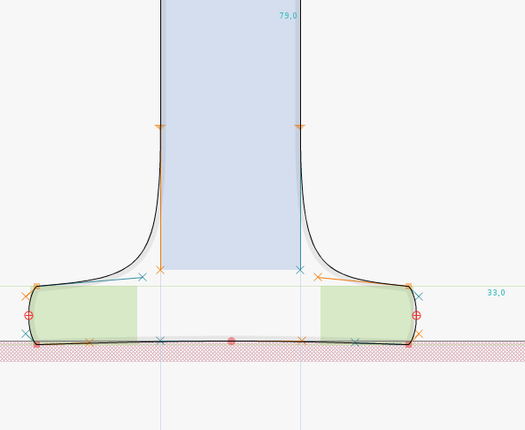
#### The foot serifs
This figure shows a foot serif of Libertine. Foot serifs are the most common serifs and give shape to the lower-case `f, h, i, k, l, m, n, r` and many more upper-case. With the letters `k, v, w, x` and `y` they occur in a diagonal form and not only at the baseline but also at the x-height. With `p` and `q` they form the descender.  
**Did you notice?** The right half of the shown serif is a bit shorter than the opposite because it is the left foot serif of the n. This is an optical measure to avoid that the both foot serifs come to close and narrow the open counter, which is important for the legibility of `n`.  
**Did you notice?** The outer left and right parts of the serif bow down a little giving the whole a concave form. This measure is called “cupped serif”.

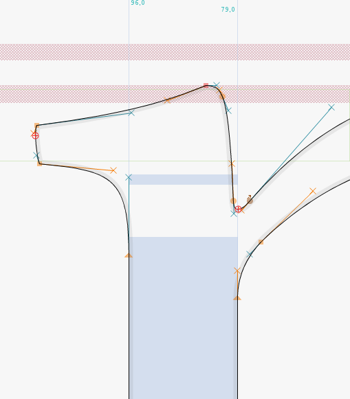
#### The middle head serifs (at x-height)
This figure shows the head serif of `n, m, r` and `p`. It is a characteristic of Libertine that this serif bows to the left and opens the angle where stem and hairline join.   
Have a look at `i` and `j`. Their head serifs are upright and don't bow left. There are just no angles to open.  
**Did you notice?** The upper spline of the head serif is a bit concave. It is “cupped” such as the foot serif.  

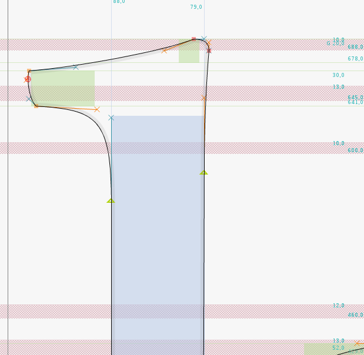
#### The upper head serifs (at ascender-height)
The upper head serifs occur in the letters `b, d, h, k,` and `l`. They look similar to the serifs of `i` and `j` but in fact they are not identical.  

&nbsp;  

&nbsp;  

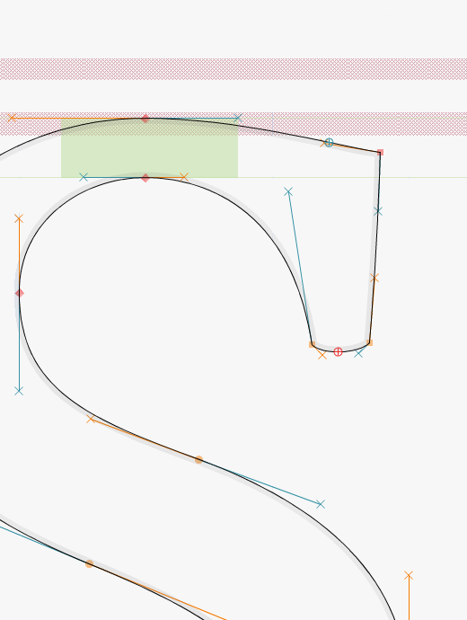
#### The half serifs
Half serifs occur at the lower-case letters `s` and `z` and at capitals such as `C, G, F, L, S, T, Z`. The halfserif of the `s` is nearly vertical while most others are diagonal. At the point where the outer contour passes over into the serif there is a right angle – a Libertine characteristic. Compare round letters such as `C` and `G` with rectangular ones such as `F` and `T`.  
**Did you notice?** The half serif’s form is actually not cupped but even slightly convex.

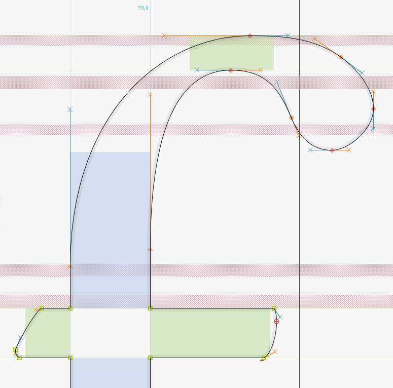
#### The drop terminals
The drop occurs at the letters `a, c, f, g, j, r` and `y`.  
**Did you notice?** The drops of Libertine’s letters are oblated at the end. You will also find that the fullstop (period) and the bulbs of `,` and `”` are flattened. This is another characteristic of Libertine.

&nbsp;  

### Two letters as primary design patterns ...
Developing a font, one starts with just a few letters, or “glyphs” as we say, and define those as as design patterns. In Libertine these are “n” and “o”.
In reverse, modifications on them cause conflicts with all derived letters, so you better don't touch them.

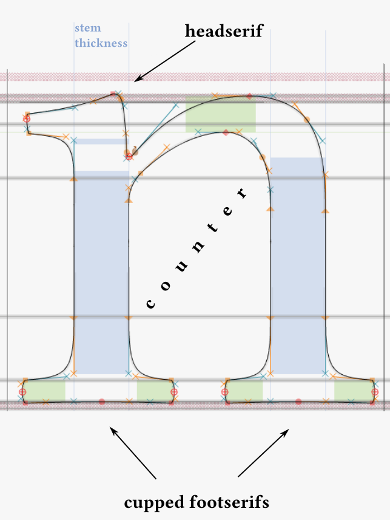
#### ... “n” for letters with serifs
The lower-case letter `n` defines:

* the **serifs**
* the **stem width**. This is 79 EM for lower-case and derived from that 85 EM for upper-case.
* **Spacing**. The inner distance between the two stems and thus the white space of the counter affects tracking and is regarded as default for optical spacing between letters.
* **font-weight**. An effect of stem width and tracking
* **x-height** and **overshoot**: The body of lower-case letters is 429 EM tall. Round parts overshoot x-height and base-line about 10 EM. This typographic measure achieves, that letters like o, e, c, but also n,m,r etc. have the same optical height as x. In fontforge the overshoot-corridor is marked in rose color.

Derived letters: `m, r, h, i, j, l, u, ...`

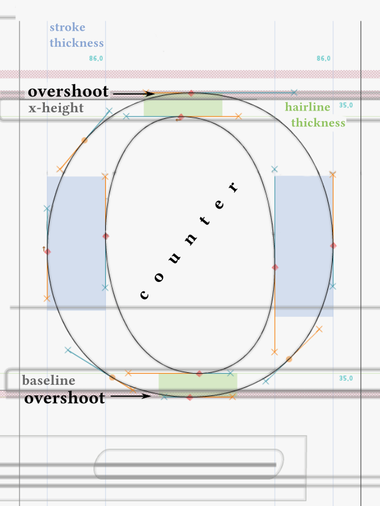
#### ... “o” for letters with round parts
The lower-case letter `o` defines the following characteristics for all letters with round parts:

* **stress**: the calligraphic angle
* **min/max. width** of round strokes, i.e. 35 EM for thinnest and 86 EM for boldest part of stroke.
* **Spacing**. The white space of the counter affects tracking.
* **Bearings** as indication for spacing of round characters.

Derived letters: `e, c`, and round parts of `b, d, p, q, g, ...`  

&nbsp;

## FontForge Font-Editor
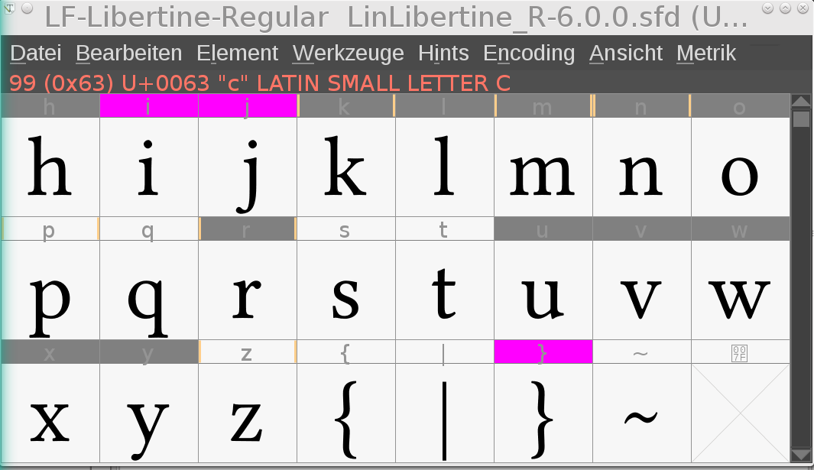

Libertine is being developed with the font editor Fontforge. Please see [Readme.md](README.md) for installation. Binary packages are available for many linux distributions (Ubuntu, Fedora, OpenSuse...) and for MacOSX. There is also a young Windows port which is still in alpha stage.
See [FontForge’s project page](http://fontforge.github.io) for more information.  
There is also a fairly good manual: [Design fonts with FontForge](http://designwithfontforge.com/en-US/index.html).

### How the sources are organized
Libertine sources are saved in the SFD directory format (SFDir). This format allows easy collaborative development in such each glyph is described in a separate `*.glyph` file. Superior description such as font name, vertical metrics, kern tables etc. are saved in the `font.props` file.
So if you added or improved a glyph, git will just upload the changed `*.glyph` file. Conflicts with other contributors working on other glyphs at the same time are being reduced. A little disadvantage of the SFDir-format is the long time FontForge needs to open and save a font.  
**Please note:** The GitHub web frontend does only show the first 1’000 files of the sfd-directory.

### The layers
In the glyph view you will find amongst others a little tool-box called “layers”. The contours of Libertine are stored in the “glyph layer”. You can use the “background layer” to store contours from another glyph for comparing certain characteristics like form, height, counter width and such. Finally the “guide layer” contains metrical lines such as x-height, caps-height etc. and it is actually unique for all glyph. So please leave that one untouched.

### Spacing
*Please complement description.*

### Overshoot and height metrics
*Please complement description.*

### Drawing splines and contours
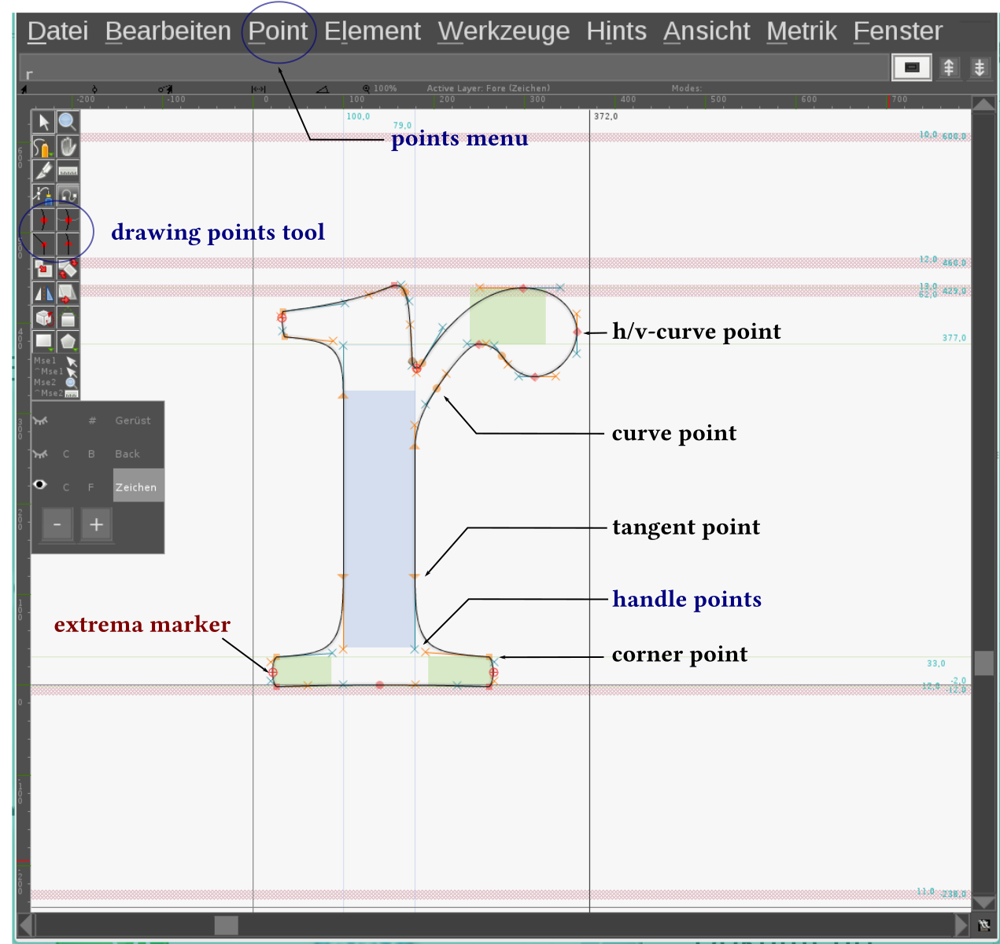
Vector based fonts such as TTF and OTF use [Bézier curves](https://en.wikipedia.org/wiki/B%C3%A9zier_curve). You will know them from vector graphics editors such as Inkscape or Illustrator. FontForge knows four different point types:

1. the curve point (left and right handle stick together)
2. the h/v curve point (90° horizontal or vertical handles)
3. the corner point (left and right handle are independent)
4. the tangent point (the handle follows the direction of the afferent spline)

You can easily change the point type via the point menu. The right-click on a point will open a context menu, allowing you to control the type and exact position of the point and its handle points.

Contours always have to be closed. Only closed contours will fill. Outer contours have to be tagged clockwise. Inner contours (forming counters) need to be tagged counter-clockwise.

### Accented glyphs

#### Working with References
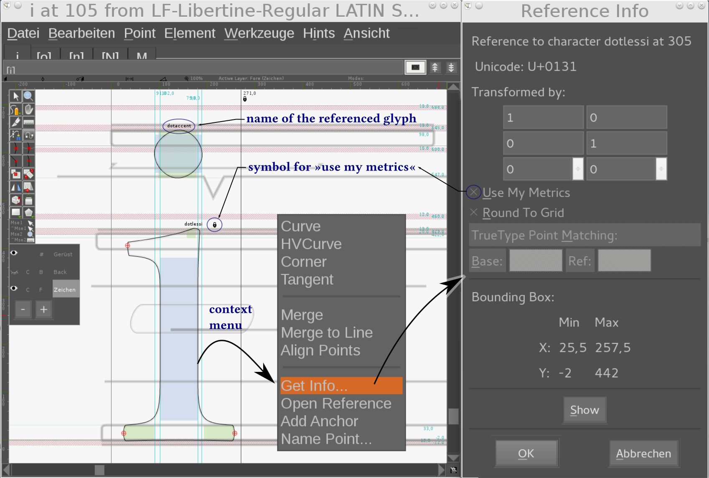

The latin codepages contain a lot of accented characters. And these are generally nothing else but different combination of basic glyphs and accents, for example the `é` is combined of `e` + `´`. In these cases you don't need to work with copied contours, you can and should make use of a reference that point to the original glyph.

**Example:** The letter `i` is in fact also an accented character made up of the glyphs `ı` (named *dottlessi*) and `˙` (named *dotaccent*). To ensure that improvements in the metrics of the referenced glyph are handed down to the derivated glyph, the checkbox “Use my metrics” has to be enabled.
Nearly all imaginable kind of accents have been encoded by now. You can find them in these two Unicode charts:  
* [Unicode-Chart Combining Diacritical Marks *U+0300–U+036F*](http://unicode.org/charts/PDF/U0300.pdf)  
* [Supplement *U+1DC0–U+1DFF*](http://unicode.org/charts/PDF/U1DC0.pdf)

#### Base marks and Anchors
*Please complement description.*

### Character weight, Stress and Stem width
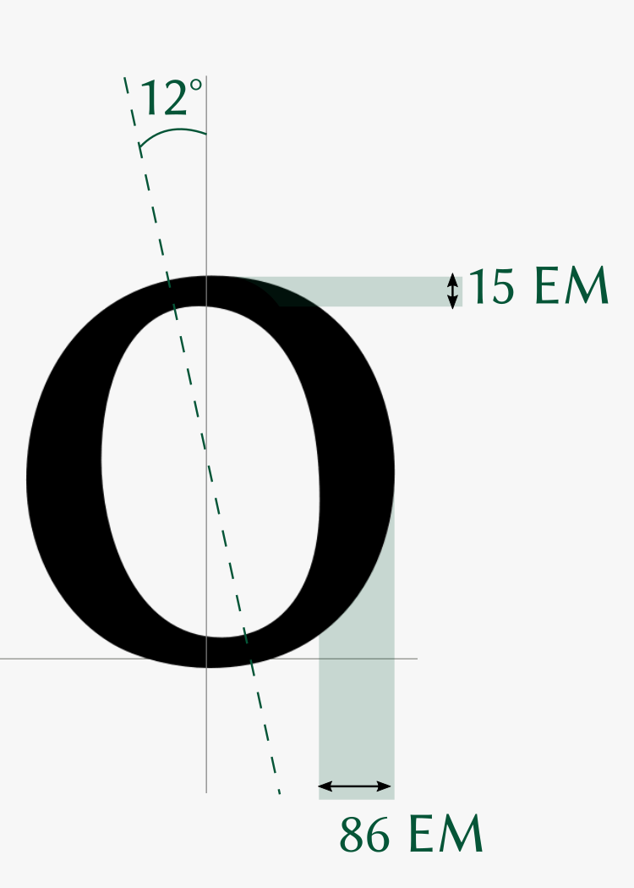

## Authors
- Gillian Tiefenlicht [GillianTL](https://github.com/GillianTL)
