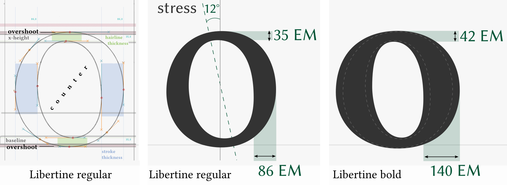

# Libertine Design-Guidelines

These are short guidelines for all volunteers who loves libre fonts in general and the Libertine font-family in special and who think about contributing to the latter.
Fonts contain dozens of glyphs, Libertine for example of about 2 000, and though they all are different, they fit together, have to fit together – in the aspect of design, of their optical weight and of their spacing. And about that, some technical issues have to be meat. 
Sounds comlicated? Never mind, we will get you into it. This what the guidelines are for.

## Design Principals / Reference Implementation
The form of a letter is a social convention, usually even a very old one. Our Latin alphabet for example was derived from the Roman letters, those based on the Greek, which again have their roots in Phoenician scripts. In 765 AD the Carolingian minuscule established as a standard for writing and thus gave our lower-case letters their present shape. With [Unicode]( http://www.unicode.org) we today have a specification, a computing industry standard, defining the name, the basic form and encoding position of nearly any known glyph in the world.

A type designer thus works with a framework. He interprets the essence of a letter and decides about design characteristics such as 

1. **Serifs**: Form and length of foot serif(s), head serif and ascender serif or even completely without => sans-serif.
2. **Font-weight**: as a result of stroke weight and spacing
3. **spacing / tracking**: The white area between letters and within them => size of counters
4. **contrast** between hairline and stem
5. **stress** or **axis**: The calligraphic angle
6. **Proportion**: x-height and cap-height, length of ascender and descender

### The serifs of Libertine 
*figures will come soon*

*Please complement description.*

Developing a font, one starts with just a few letters, or “glyphs” as we say, and define those as as design patterns. In Libertine these are “n” and “o”.
In reverse, modifications on them cause conflicts with all derived letters, so you better don't touch them. 

### The letter »n« as a primary design pattern for letters with serifs

The lower-case letter `n` defines:

* the **serifs**
* the **stem width**. This is 79 EM units for lower-case and derived from that 85 EM units for upper-case.
* **Spacing**. The inner distance between the two stems and thus the white space of the counter affects tracking and is regarded as default for optical spacing between letters.
* **font-weight**. An effect of stem width and tracking
* **x-height** and **overshoot**: The body of lower-case letters is 429 EM tall. Round parts overshoot x-height and base-line about 10 EM. This typographic measure achieves, that letters like o, e, c, but also n,m,r etc. have the same optical height as x. In fontforge the overshoot-corridor is marked in rose color.

Derived letters: m, r, h, i, j, l, u, ...

### The letter »o« as a primary design pattern for letters with round parts

The lower-case letter `o` defines the following characteristics for all letters with round parts: 

* **stress**: the calligraphic angle
* **min/max. width** of round strokes, i.e. 35 EM for thinnest and 86 EM for boldest part of stroke.
* **Spacing**. The white space of the counter affects tracking.
* **Bearings** as indication for spacing of round characters.

Derived letters: e, c, and round parts of b, d, p, q, g, ...

## FontForge Font-Editor
Libertine is being developed with the font editor Fontforge. Please see Readme.md for installation. Binary packages are available for many linux distributions (Ubuntu, Fedora, OpenSuse...) and for MacOSX. There is also a young Windows port which is still in alpha stage.
See [FontForge’s project page](http://fontforge.github.io) for more information.

### How the sources are organized
Libertine sources are saved in the SFD directory format. This format allows easy collaborative development in such each glyph is described in a separate *.glyph file. Superior description such as font name, vertical metrics, kern tables etc. are saved in the font.props file.
So if you added or improved a glyph you just need to upload the *.glyph file and conflicts with other contributors working on the same time on other glyphs is minimized.
Please note: The GitHub web frontend does only show the first 1000 files of the sfd-directory.

### The layers
In the glyph view you will find amongst others a little tool-box called “layers”. The contours of Libertine are stored in the “glyph layer”. You can use the “background layer” to store contours from another glyph for comparing certain characteristics like form, height, counter width and such. Finally the “guide layer” contains metrical lines such as x-height, caps-height etc. and it is actually unique for all glyph. So please leave that one untouched.

### Spacing
*Please complement description.*

### Overshoot and height metrics
*Please complement description.*

### Drawing splines and contours

Vector based fonts such as TTF and OTF use [Bézier curves](https://en.wikipedia.org/wiki/B%C3%A9zier_curve). You will know them from vector graphics editors such as Inkscape or Illustrator. In FontForge there are four different point types:

1. the curve point (left and right handle stick together)
2. the h/v curve point (90° horizontal or vertical handles)
3. the corner point (left and right handle are independant)
4. the tangent point (the handle follows the direction of the afferent spline)

You can easily change the point type via the point menu. The right-klick on a point will open a context menu, allowing you to control the type and exact position of the point and its handle points.

Contours always have to be closed. Only closed contours will fill. Outer contours have to be tagged clockwise. Inner contours (forming counters) need to be tagged counter-clockwise. 

### Accented glyphs 

#### Working with References

The latin codepages contain a lot of accented characters. And these are generally nothing else but different combination of basic glyphs and accents, for example the `é` is combined of `e` + `´`. In these cases you don't need to work with copied contours, you can and should make use of a reference that point to the original glyph. 

**Example:** The letter `i` is in fact also an accented character made up of the glyphs `ı` (named *dottlessi*) and `˙` (named *dotaccent*). To ensure that improvements in the metrics of the referenced glyph are handed down to the derivated glyph, the checkbox “Use my metrics” has to be enabled. 
Nearly all imaginable kind of accents have been encoded by now. You can find them in these two Unicode charts:  
* [Unicode-Chart Combining Diacritical Marks *U+0300–U+036F*](http://unicode.org/charts/PDF/U0300.pdf)  
* [Supplement *U+1DC0–U+1DFF*](http://unicode.org/charts/PDF/U1DC0.pdf)

#### Base marks and Anchors
*Please complement description.*

### Character weight, Stress and Stem width

## Authors
- Gillian Tiefenlicht [GillianTL](https://github.com/GillianTL)

